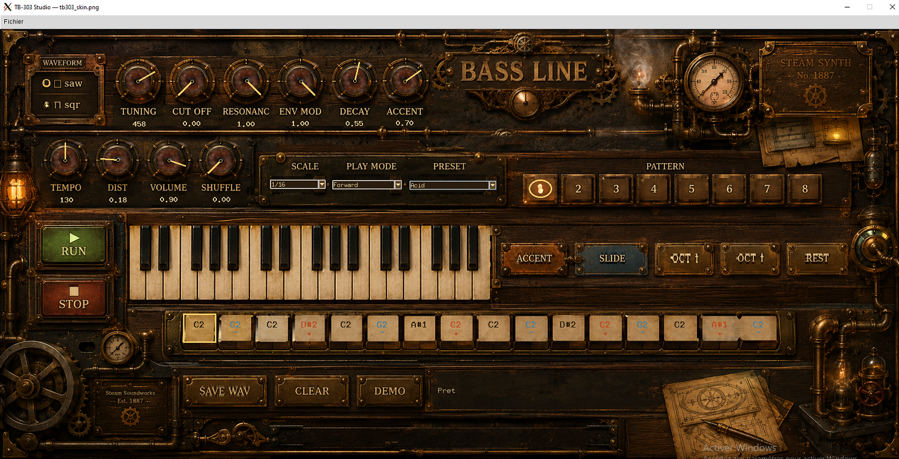

# TB-303 Studio — Bass Line (acid synth + steampunk skin)

**by Stéphane "ZFEbHVUE"**



An *acid* bass synthesizer inspired by the Roland TB-303, written in pure Python
(NumPy). It comes with an image-skinned steampunk interface, a real-time audio engine,
a sampler that can play **real instruments** (sax, drums, anything you load), and a
second interface designed for **15 kHz arcade CRTs**.

> **Technical honesty.** This is **not** a component-accurate clone of the TB-303
> circuit. It is a **character emulation**: anti-aliased saw/square oscillator, a
> resonant ~18 dB/oct ladder filter swept by the envelope, accent, slide, and a
> sequencer with swing. The panel art is original — no Roland branding, logo, or sample.

---

## What's included

| File | Role |
|---|---|
| `tb303.py` | Offline synthesis engine + sequencer (NumPy only). Used for WAV export. |
| `tb303_rt.py` | **Real-time** TB-303 engine (sounddevice callback + Numba DSP). Live knobs. |
| `tb303_studio-v2.0.py` | Main GUI: the steampunk image skin with all controls overlaid. |
| `tb303_skin.png` | The skin image (steampunk panel). |
| `instruments.py` | Non-303 voices: a **sampler** + synthetic sax/brass, with a resonant filter. |
| `instruments_rt.py` | **Real-time** engine for the instruments (sample playback + 303 filter). |
| `tb303_crt.py` | A separate **640x480 vector interface** for CRT/arcade screens (multi-theme). |

All files must live in the **same folder**.

---

## What this project can do (feature tour)

**The synth.** Saw/square oscillator -> 303-style 4-pole ladder filter (output tapped at
the 3rd pole, ~18 dB/oct, 4th-pole resonance feedback with tanh saturation) -> filter and
amp envelopes -> accent, slide, distortion. A 16-step sequencer with banks, subdivisions,
swing and play modes.

**Real-time playback.** With Numba + sounddevice, audio is generated continuously block
by block; turning a knob is heard **instantly**, with no loop restart. Without them, it
falls back to a pygame render-and-loop. The TB-303 *and* the instruments each have their
own real-time engine.

**Play other instruments, not just the 303.** An **Instrument** menu lets you switch the
voice to a synthetic **Sax** or **Brass**, or **load your own sample** (a real sax, a
piano, anything). The sample is replayed at the right pitch for every note of the
sequence, and it runs through the **same resonant 303 filter**, so CUT OFF / RESONANCE /
ENV MOD / DECAY / DIST shape your sax exactly like the 303 (you can make an *acid sax*).
The instruments play in real time too.

**Load and save in any format.** Loading a sample accepts **WAV, MP3, FLAC, OGG, AIFF,
M4A, AAC, OPUS, WMA** (via `soundfile`/`ffmpeg`, with a built-in WAV reader as fallback,
including 24-bit). Exporting audio likewise offers **WAV, FLAC, OGG, MP3, AIFF**.

**Live VU meters.** The steampunk lamps on the panel are wired as VU meters: the glass of
each bulb **brightens with the music** (dark on silence, blazing on hits) — the glow is
confined to the bulb, no halo.

**Editable projects.** Save the whole session (all knobs, waveform, menus, the 8 pattern
banks) to a `name.tb303` file and reload it later, exactly as it was.

**A CRT interface.** `tb303_crt.py` is an alternate UI drawn entirely with vector shapes
(no image), sized 640x480 for 15 kHz interlaced arcade monitors, with two themes
(**arcade neon** and **cyberpunk**), switchable live.

---

## Requirements and installation

| Package | Why | Needed for |
|---|---|---|
| **NumPy** | Synthesis | always |
| **Pillow** (+ ImageTk) | Show the skin image | the GUI |
| **Tkinter** | Window and widgets | the GUI (usually preinstalled) |
| **numba** | Compiles the real-time DSP | real-time mode |
| **sounddevice** | Real-time audio output | real-time mode |
| **pygame** | Fallback playback when real-time is unavailable | optional fallback |
| **scipy** | Nicer filtering for the synthetic instruments | optional |
| **soundfile** / **ffmpeg** | Load/save MP3/FLAC/OGG/M4A... | non-WAV formats |

Install into the **same Python that runs the script**:

```bash
python3 -m pip install numpy pillow numba sounddevice pygame scipy soundfile
sudo apt install libportaudio2          # Linux: needed by sounddevice
sudo apt install ffmpeg                  # optional: lets you load/save any audio format
```

**Ubuntu (system Python)** — also get ImageTk and Tk:

```bash
sudo apt install python3-pil.imagetk python3-tk
```

> **Environment note.** numba/sounddevice must be in the env you launch from. If you
> installed them in a conda env (e.g. `xtts`), either launch from it or install them in
> your base env. Nothing in this project depends on a specific env.

---

## Quick start

```bash
python3 tb303_studio-v2.0.py            # main steampunk studio
python3 tb303_crt.py               # CRT interface (arcade neon)
python3 tb303_crt.py cyber         # CRT interface (cyberpunk)
```

The demo pattern is loaded on launch — press **RUN** (or Space on the CRT) and turn the
knobs while it plays.

---

## The interface

Everything is clickable on the image: the **WAVEFORM** toggle, the **10 knobs**
(TUNING, CUT OFF, RESONANCE, ENV MOD, DECAY, ACCENT, TEMPO, DIST, VOLUME, SHUFFLE),
the **SCALE / PLAY MODE / PRESET** menus, **PATTERN 1-8** banks, **RUN/STOP**, the
3-octave **keyboard** (with working black keys/sharps), the per-step modifiers
**ACCENT / SLIDE / OCT down / OCT up / REST**, the **16-step** strip, and **SAVE WAV /
CLEAR / DEMO**. Adjust a knob with the mouse wheel or a vertical drag.

### Programming a pattern

1. Click a **cell** in the 16-step strip (amber frame = selected).
2. Click a **key** -> the note lands on that step (and sounds), selection advances.
3. Select a step, then **ACCENT** (`+`, louder/brighter), **SLIDE** (`~`, glide to the
   next note), **OCT down/up**, or **REST** (silence).
4. **PATTERN 1-8**: eight independent banks. **CLEAR** empties; **DEMO** reloads the example.
5. **RUN** loops; turn the knobs *while playing* — they update live.

### Knob reference

| Knob | Range | Default | Effect |
|---|---|---|---|
| TUNING | 400-480 | 440 | Fine global tuning. |
| CUT OFF | 0-1 | 0.40 | Filter cutoff (opens/closes the tone). |
| RESONANCE | 0-1 | 0.10 | Resonant peak at the cutoff (the acid squelch). |
| ENV MOD | 0-1 | 0.12 | How much the envelope opens the filter per note. |
| DECAY | 0-1 | 0.40 | Length of the per-note filter sweep. |
| ACCENT | 0-1 | 0.30 | Intensity of accented (`+`) steps. |
| TEMPO | 60-200 | 130 | BPM. |
| DIST | 0-1 | 0.00 | Saturation after the filter. |
| VOLUME | 0-1 | 0.90 | Output level (playback and export). |
| SHUFFLE | 0-0.66 | 0.00 | Swing on alternate steps. |

**The acid recipe:** high RESONANCE + low CUT OFF + high ENV MOD, then sweep CUT OFF while
it plays.

---

## Instruments (sax, samples, drums...)

Use the **Instrument** menu (in the studio's menu bar):

- **TB-303** — the synth (default).
- **Sax / Brass** — built-in synthetic voices (no file needed; recognizable, but synthetic).
- **Load sample (.wav)...** — load your own audio (any format). It's replayed at the pitch
  of every step.

Whatever instrument is selected, the sound runs through the **303 resonant filter +
distortion**, so all the filter knobs stay active — you can filter and saturate a real
sax into an acid line. **SAVE WAV** exports with the chosen instrument.

**Tips for samples.** The sampler is *melodic*: it works best with a **single sustained
note** (a held sax/piano note), auto-detecting its base pitch. Stay within ~1-2 octaves of
the original to keep the timbre natural. One-shot effects (whooshes, drums, risers) don't
fit the melodic sampler well — they retrigger from the start on each step, so a short step
only plays their beginning. (A dedicated one-shot/FX mode can be added if needed.)

**Free, legal sounds.** The **VCSL** library (Versilian Community Sample Library) is
**CC0 / public domain** and a great source of single-note instrument samples (sax, piano,
harp, brass...). The bundled real tenor-sax note comes from VCSL.

---

## Save and recall a project (`.tb303`)

| Action | Menu | Shortcut |
|---|---|---|
| Save project | File -> Save project... | **Ctrl+S** |
| Open project | File -> Open project... | **Ctrl+O** |
| Export audio | File -> Export WAV... / SAVE WAV | — |

A `.tb303` file (human-readable JSON) stores all 10 knobs, the waveform, the
Scale/Play Mode/Preset menus, the current bank, and the 8 full pattern banks.

---

## The CRT interface (`tb303_crt.py`)

A second UI drawn entirely with vector shapes (no image), fixed at **640x480** for
15 kHz interlaced arcade monitors — bold shapes, high contrast, thick strokes, no thin
hairlines that flicker when interlaced. Same engines, same controls, same `.tb303`
projects. Two themes: **crt** (arcade neon) and **cyber** (cyberpunk). Launch with a theme
(`python3 tb303_crt.py cyber`) or press **T** to switch live. Space = RUN/STOP.

---

## Under the hood: the two real-time engines

`tb303_rt.py` and `instruments_rt.py` share the same idea: a sounddevice callback fills
the audio buffer block by block, reading the parameters and the pattern on **every block**,
so a knob change is heard immediately. The per-sample DSP is compiled with **Numba**
(`@njit`). `tb303_rt.py` synthesizes the 303 (oscillator + ladder); `instruments_rt.py`
reads a **sample** at a pitch-dependent rate (linear interpolation, continuous position)
and runs it through the **same ladder filter**. Only one audio stream runs at a time:
switching between the 303 and an instrument hands the device from one engine to the other.
Without Numba/sounddevice, both fall back to a pygame render-and-loop.

You can test the engines on their own:

```bash
python3 tb303_rt.py            # plays the 303 demo and sweeps the cutoff (live)
python3 instruments_rt.py      # pre-renders a sax, plays the demo, sweeps the cutoff (live)
```

---

## Troubleshooting

**No sound / RUN does nothing.** You need an audio backend: `pip install numba sounddevice`
(real-time) or `pip install pygame` (fallback). SAVE WAV works without audio.

**A loaded sample is silent.** It's probably a **one-shot effect** (a whoosh/riser) whose
energy is at the end and whose pitch can't be detected — the melodic sampler retriggers
from the (quiet) start each step. Use a **sustained single note** instead, or trim the
silent head.

**Can't load an MP3/M4A.** Install `soundfile` or `ffmpeg`. WAV/FLAC/OGG/AIFF work via
soundfile; MP3/M4A/etc. go through ffmpeg.

**Crackle in real-time (often on WSL).** Increase the blocksize (`RealtimeEngine(blocksize=512)`).

**Window won't open / ImageTk error (Ubuntu).** `sudo apt install python3-pil.imagetk python3-tk`.

**WSL: `couldn't connect to display "<IP>:0"`.** WSLg serves the display on `:0`, not on the
Windows IP. If an old line in `~/.bashrc` (or a startup script) forces
`export DISPLAY=<IP>:0`, comment it out — WSLg sets `DISPLAY=:0` automatically. Quick test:

```bash
export DISPLAY=:0
python3 tb303_studio-v2.0.py
```

If it works after that, find and disable the offending line:

```bash
grep -n "export DISPLAY" ~/.bashrc ~/.profile ~/.bash_profile
```

If WSLg itself is missing (`/mnt/wslg/.X11-unix/` empty), update WSL from Windows
PowerShell: `wsl --update`, then `wsl --shutdown`.

**Sound only works inside a conda env.** That just means numba/sounddevice are installed
there. Install them in your base env to avoid having to activate anything.

---

## Credits

- Synthesis, interfaces and code: **Stéphane "ZFEbHVUE"**.
- Bundled real saxophone note: **VCSL — Versilian Community Sample Library** (CC0 / public
  domain).

*Character emulation for personal/educational use. Original panel design; no Roland
branding, logo, or sample is used.*
